# Craps: what creates and destroys FLIP

**Pre-reserve baseline · 28 September 2026 · 500k high retail, 21× average exposure**

**Current implementation:** 5% of Added now funds the high-roller reserve. See the [current reserve report](CRAPS-HIGH-ROLLER-INCENTIVE-PROPOSAL.md) for its allocation, revised totals and break-even points; the figures below preserve the baseline for comparison.

The intended feedback is **emit when quiet, attract play, then absorb the subsidy through activity**. With fewer competitors, each eligible entrant has more opportunity to capture the shared prizes. More entrants dilute that opportunity and expose more paid FLIP to engine losses. Deliberate emission is part of the design.

**Design criterion:** quiet-field rewards can attract players, and comp allowance received by the vault can leave the system modestly emissive even when paid players lose. New wallets may also profit on quiet days, but pay a 5% entry premium until they qualify through mint/pass history. System emission and player profit must be measured separately.

Craps can create rewards **without new ETH arriving that day**. Added references a historical ETH prize pool and ticket price, but is not limited to that day's ETH inflow. Its ongoing subsidy therefore needs a FLIP activity budget. This report does not audit the other protocol emission sources.

This report measures only craps. **No Coinflip outcomes or multipliers are included.** “Net FLIP” means new payout value plus new deferred rewards, less paid funding. It includes progressive funding and comp allowances once, at face value; it is not a same-day ERC20 mint counter.

| Central estimate | Later floor: Added 50k | Early floor: Added 150k |
|---|---:|---:|
| No outside paid play, one unfunded normal house seat | **+119,500/day** | **+210,700/day** |
| Normal 25k future days to break even **before comps** | **95/day** | **167/day** |
| Normal future days to break even **including comps** | **119/day** | **210/day** |
| Paid volume at break-even including comps | **2.975m/day** | **5.250m/day** |
| 200 normal future passes/day | **−82,800/day** | **+9,200/day** |

These estimates use 18% engine loss on exposed bankroll, steady participation, full rewards at standard entry prices, filled free-seat draws, and no purchase boons or quest rewards. The house assumption deliberately allows one unfunded normal seat every day; actual house backing can reduce that cost. Added can exceed either floor.

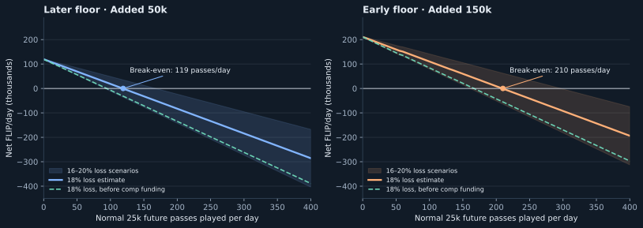

**Main findings:** a normal future pass absorbs about **1,272 before comps / 1,014 after comps**. A contested high future pass absorbs about **7,204 before comps**, then allocates **12,282 to comps**, giving **5,078 net emission**. Another 100k of Added costs roughly **91k** after engine losses. The ordinary 50k/day base already existed before the jackpot replacement; the replacement doubled the later jackpot percentage from 0.25% to 0.5%, with new floors.

The shaded bands show 16–20% engine-loss scenarios, not statistical confidence intervals. Positive values are emissions; negative values are contraction. All daily figures refer to a modeled day of play being opened and settled.

## 1. The accounting: where issuance comes from

A player's funded bounty is mostly a transfer to another player. A bankroll that busts retires value. Protocol Added, ordinary bonuses, boons and comp allowances create value unless offset by those losses or purchase-price margins.

```text
Net craps issuance
  = Jackpot Added + ordinary fixed allocation
  + entry value provided without funding + advance-price discounts
  + action-based bonuses + new comp allowance + other new rewards
  − engine losses − advance-price premiums − newcomer premiums
```

The jackpot and ordinary bonus multipliers have mean one. They change the timing and variance of the amounts in this identity. Engine losses are applied only to capital exposed to the dice, not indiscriminately to every FLIP in the pot.

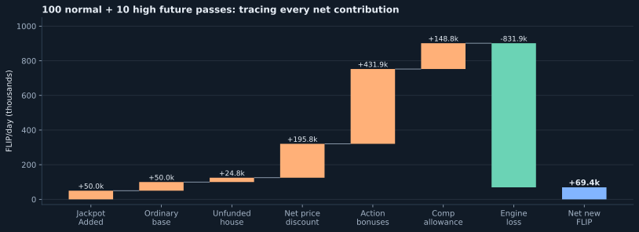

The example spends **7.5m/day**: 100 normal future passes and 10 high future passes. With Added 50k and one unfunded house seat, it creates **69,359 net FLIP/day including comp funding** at 18% engine loss.

| Funding item | FLIP/day | Interpretation |
|---|---:|---|
| Jackpot Added + ordinary fixed base | +100,000 | Two separate protocol allocations |
| Unfunded normal house capital | +24,825 | Entry capital supplied without a burn |
| Net future-price discount | +195,750 | Ten high discounts of 21,325, less 100 normal premiums of 175 |
| Action-based allocation | +431,919 | 12% of eligible action, through the trailing book |
| Comp allowance | +148,787 | Standard comps plus extra-high loss recycling |
| Engine losses | −831,922 | Expected destruction on capital actually at risk |
| **Net** | **+69,359** | Rounding in displayed line items only |

**Avoid double counting.** Bank the progressive cost when funded; its later payout releases that liability. Book a comp or pass grant when awarded; its use consumes the existing entitlement. A purchased future pass is funding held against future play, so purchasing and playing it on different days shifts cash timing without creating two contributions. Donations funded by a burn are transfers, while donations funded by an existing comp allowance consume that allowance.

The pass denominations are 24,800 normal and 520,800 high, versus underlying entry-cost EVs of 24,825 and 521,325. A full entitlement-lifecycle ledger must also capture these small redemption differences; the paid-pass scenarios here use the actual 25k/500k purchase prices directly.

## 2. Activity mix determines the slope

**A normal future day costs 25,000 for 24,825 of expected entries. A high future day costs 500,000 for 521,325 of expected entries.** The normal price includes a 175 premium; the high price includes a 21,325 discount. The high draw is 10× with probability 79/90 and 100× with probability 11/90: mean 21×. A discount to entry value does not itself imply positive player EV. “Live” below means paying actual entry fees, averaged over the same day distribution.

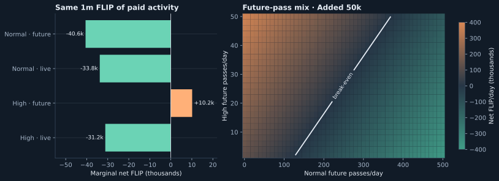

| Additional full day of play | Paid funding | Marginal net FLIP, at 18% loss |
|---|---:|---:|
| Normal future pass | 25,000 | **−1,014** |
| Normal at live fees | 24,825 EV | **−839** |
| Contested high future pass | 500,000 | **+5,078** |
| Contested high at live fees | 521,325 EV | **−16,247** |

Marginal values use a large existing field, including the future bonus and comp liabilities caused by that play. They are system margins, not the individual buyer's profit. Much of the additional value goes to other winners, the progressive or the shared comp fund. Jackpot bankroll rounding causes small variations with field size.

**One high roller is a separate case.** Its extra bounties ride its own run and can bust. With two or more high seats, the high bounties redistribute among them even if all their bankrolls bust. At the later floor, a sole high future day reduces the no-outside-play estimate from 119.5k to 106.4k; ten contested high future days raise it to 170.3k including the comp allocation. The mixed-field chart starts at two high seats for this reason.

**A turnover number alone is insufficient.** At the central estimate, an extra 1m of normal future play contracts by about 40.6k, while 1m of contested high future play emits about 10.2k including comps. Both contract before comps. The desired activity level depends on how much of each kind is played.

## 3. Break-even points: before and after comp funding

These are the first whole numbers of full future-pass days consumed per day that cover the modeled issuance budget. They include one unfunded normal house seat, a stable seven-day action book, standard entry prices, full rewards, filled awards and no boons or quests. They are not forecasts of unique wallets or pass purchases on that calendar day.

### Normal-only activity: 25k per day-pass

| Engine bankroll loss | Added 50k: before comps | Added 50k: all issuance | Added 150k: before comps | Added 150k: all issuance |
|---|---:|---:|---:|---:|
| 14% stress scenario | 178 | 285 | 314 | 504 |
| 16% | 124 | 168 | 219 | 297 |
| **18% central estimate** | **95** | **119** | **167** | **210** |
| 20% | 77 | 92 | 134 | 161 |

At 18%, the before-comp funding thresholds are **2.375m / 4.175m per day**. Covering comp allocations as well requires **2.975m / 5.250m**. Removing the unfunded house allowance lowers the latter counts to **95 / 186**. That removes a cost assumption; it does not change pass prices.

### High-only activity: 500k per day-pass

| Engine bankroll loss | Added 50k: before comps | Added 50k: all issuance | Added 150k: before comps | Added 150k: all issuance |
|---|---:|---:|---:|---:|
| 14% | No crossing | No crossing | No crossing | No crossing |
| 16% | 125 | No crossing | 221 | No crossing |
| **18% central estimate** | **17** | **No crossing** | **30** | **No crossing** |
| 20% | 9 | 103 | 16 | 182 |

At 18%, **8.5m / 15m of high-only daily funding covers the budget before comps**. Adding more contested high future passes does not bring the total including comps to zero: each adds about 5.1k of issuance. This is the accepted comp-fund outcome, not a claim that the buyer profits. “No crossing” is supported by a positive lower bound on modeled issuance, not just a search that stopped too soon.

### Paying live entry fees instead

| 18% loss, live full days | Added 50k: before comps | Added 50k: all issuance | Added 150k: before comps | Added 150k: all issuance |
|---|---:|---:|---:|---:|
| Normal, 24,825 mean fees | 110 | 144 | 194 | 253 |
| High, 521,325 mean fees | 5 | 8 | 8 | 13 |

Live normal fees remove the 175 future-price premium, slightly weakening contraction. Live high fees remove the 21,325 future-price discount, strengthening it. These are separate funding scenarios, averaged over the same random entry distribution.

## 4. Player returns and vault comp funding

At 18% loss, each additional contested high future pass creates about **465.2k in run/pot returns**, **27.6k of bonus/progressive funding**, and **12.3k of shared comp allowance**, against a **500k** purchase. Before comps, that is about **7.2k of contraction**. Including comps, it is **5.1k of issuance**. The latter is not a 1% profit for the buyer.

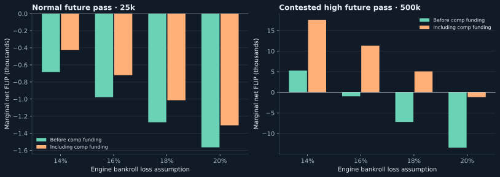

| Engine bankroll loss | Net before comps | New comp allowance | Total-system net |
|---|---:|---:|---:|
| 14% | +5,272 | +12,282 | +17,553 |
| 16% | −966 | +12,282 | +11,316 |
| 18% | **−7,204** | **+12,282** | **+5,078** |
| 20% | −13,441 | +12,282 | −1,159 |

This counts all marginal bonus/progressive funding, including amounts the buyer may not receive. It excludes the buyer's share of fixed subsidies and purchase boons, and therefore is **not a complete per-wallet EV calculation**. The buyer competes for shared bonuses and does not automatically receive the vault comp budget. Activity score no longer changes craps rankings or reward amounts; newcomers instead pay 5% more upfront.

The policy target is emission when quiet and contraction when busy, with intentional comp-fund emission permitted even for high-pass activity. Quiet-field subsidy capture is the participation incentive, including for newcomers. The pricing rule gives qualified players a better deal: minted this/last level, at least three credited lifetime levels, or deity status. Standard prices, 21× mean exposure, reward values and 21:1 pass conversion are retained. The tables use standard prices; a newcomer normal/high future pass burns another **1,250 / 25,000** with no added game capital or comp allowance. See the [entry-pricing EV analysis](CRAPS-ENTRY-PRICING-EV.md) for player returns at different field sizes.

## 5. Mixed fields: how much normal play covers the budget?

At 18% loss, high future play helps cover the budget before comps. Including the comp budget, each additional contested high future day needs roughly **five additional normal future days** to offset its marginal issuance.

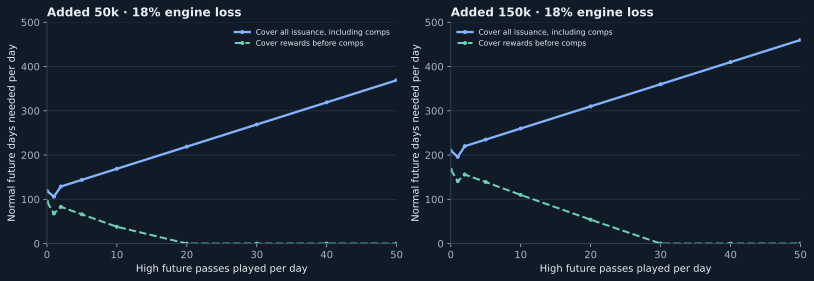

| High future days/day | Added 50k: normal days before comps | Added 50k: normal days including comps | Added 150k: normal days before comps | Added 150k: normal days including comps |
|---|---:|---:|---:|---:|
| 0 | 95 | 119 | 167 | 210 |
| 1, sole high | 68 | 106 | 141 | 196 |
| 2 | 83 | 129 | 156 | 220 |
| 5 | 66 | 144 | 139 | 235 |
| 10 | 38 | 169 | 110 | 260 |
| 20 | 0 | 219 | 54 | 310 |
| 50 | 0 | 369 | 0 | 460 |

For example, at Added 50k, **100 normal + 10 high** contracts by **79,427 before comps**, funds **148,787 of comps**, and emits **69,359 overall**. At the same ten-high count, 169 normal days cover all of it. Zero in the before-comp columns means that high activity already covers the fixed budget.

### A useful approximate budget equation

For normal future count N and either zero or at least two high future seats H, at the later floor:

```text
Before-comp net/day ≈ 119,200 − 1,272 N − 7,204 H + Q
New comp budget/day ≈     260 +   258 N + 12,282 H
Total net/day       ≈ 119,500 − 1,014 N +  5,078 H + Q
```

Q is other newly funded rewards per day. At the early floor, replace the fixed terms with approximately **210,400 / 260 / 210,700**. These equations explain the slope; the tables use exact jackpot granules. They omit the sole-high special case and cannot replace the model at large bankroll caps.

For a growing fixed mix to contract including comps, it needs approximately **N > 5H**, or just over **20% of paid volume in normal future passes**, before extra rewards. Enough total volume is then needed to cover the fixed budget. Before comps, both types already contribute toward that budget at the central estimate.

## 6. Just the main event at jackpot time

The jackpot event has the intended **emit-when-quiet, contract-with-more-play** feedback for both normal and funded high entries under the central estimate. It has one Added budget, one 8k base fee per paid seat, and fee-only high extras. It does **not** carry the ordinary 50k daily base or the other five battles' costs.

This section funds entries at their event fees: **8,000 normal**, or **168,000 high on average** across the 10×/100× distribution. The latter is an allocation of actual entry fees, not a separately sold 168k advance product. The 500k advance high pass covers the entire day; its 21,325 whole-day discount is not charged entirely to this event.

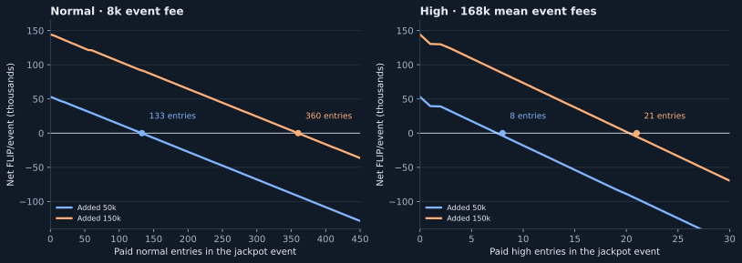

| 18% engine loss; one unfunded normal house seat | Added 50k | Added 150k |
|---|---:|---:|
| Quiet event, including comps and future bonus funding | **+53,113** | **+144,290** |
| Normal entries, future bonus funding included, **before comps** | **121** | **328** |
| Normal entries to cover event payouts and comps | 83 | 226 |
| Normal entries to also cover future bonus funding | **133** | **360** |
| High entries, future bonus funding included, **before comps** | **4** | **10** |
| High entries to cover event payouts and comps | 8 | 20 |
| High entries to also cover future bonus funding | **8** | **21** |

The comprehensive normal thresholds represent **1.064m / 2.880m in event fees**. The high thresholds represent **1.344m / 3.528m mean event fees**. Counts refer to paid entries in this event, plus the modeled house and 5/15 free awards. They are not whole-day pass requirements.

**A normal entry:** roughly half its fee is exposed to dice. With bankroll granules, the large-field marginal expected engine loss is about **687 FLIP**, creating about **40 in comps** and **242 in future action bonuses**. The remainder is about **405 of net contraction per entry**, after funding both. The basic no-rounding approximation is 720 − 44 − 264 = 412.

**A contested high entry:** the average 160k of extras loses **14,400**, credits **7,680 to the comp fund**, and retains **6,720 of contraction**. It creates no future action bonus on those extras. Adding the base entry gives approximately **7,125 of contraction per high entry**, including all modeled comp and future bonus funding. A sole high risks its extra bounty too, doubling the extra-capital loss and comp basis.

The future 12% action allocation is paid through the ordinary battles' trailing book. Counting it here assigns its cost to the activity that generates it; do not add it again to the full-system report. It is valued at its funding amount before any later loss from a sole high bonus riding a run. Existing progressive releases are previously funded value. Boons, quests and new external grants remain excluded.

Without the unfunded house allowance, quiet-event emission is approximately **45.6k / 136.7k**. Added goes into the main field, so fewer eligible competitors make the shared subsidy more attractive. Extra high units do not multiply a seat's access to Added. Higher participation can cover this event's subsidy; the precise demand equilibrium still depends on obtainable prizes and eligibility.

## 7. Your 100-day growth scenario

Start with **10 paid players on day 1**, add **3 each day**, and have everyone return daily. Every 50th player uses a high entry: high count = floor(total players / 50), with one base seat per player. Added stays at **150k through day 19**, then **50k from day 20**, assuming the pool-percentage calculation does not exceed those floors. The other assumptions match the jackpot-only model: 18% engine loss, one unfunded normal house, filled free awards, event-fee funding, no boons or quests.

**By day 100: 307 players, including 6 high rollers; 110,910 FLIP of expected contraction that day; 1,239,165 FLIP of cumulative contraction.** These figures already include comps and the full future bonus funding attributable to the events. They exclude the other ordinary battles' own activity and fixed base.

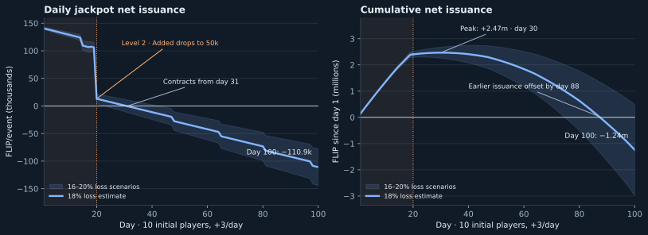

| Day | Paid players | High players, included in total | Net from that event | Cumulative net |
|---|---:|---:|---:|---:|
| 1 | 10 | 0 | +140,624 | +140,624 |
| 19 | 64 | 1 | +106,071 | +2,389,914 |
| 20, level 2 | 67 | 1 | +13,035 | +2,402,949 |
| 31 | 100 | 2 | **−301** | +2,466,265 |
| 50 | 157 | 3 | −30,083 | +2,209,526 |
| 80 | 247 | 4 | −73,169 | +634,002 |
| 100 | 307 | 6 | **−110,910** | **−1,239,165** |

Expected daily issuance becomes negative on **day 31**. Cumulative issuance peaks at **2.467m on day 30**, then declines; by **day 88**, subsequent contraction has covered all earlier issuance. Every high player still buys a normal base place; the first high arrives on day 15, the second on day 31, and the sixth on day 98. The first high risks its extra bounty too, which the model handles separately.

### Where the 100-day budget goes

Across **15,850 paid player-events**, expected event fees total **169.68m**. There are **6.9m of Added** and **800k of unfunded house entry value**. Expected engine losses remove **15.614m**; the system allocates **2.823m to comps** and **3.852m to future bonuses/progressive funding**. The net is **6.9m + 0.8m − 15.614m + 2.823m + 3.852m = −1.239m**. Before comps, cumulative contraction is **4.062m**.

Of the comp budget, **2.181m comes from high extras** and approximately **642k from base-fee action**. On day 100 alone, paid fees average **3.416m**, comps receive **58,474**, and the event generates **74,364** of future bonus funding. These are shared budget allocations, not cashback owed to those buyers.

### Timing and sensitivity

The headline charges all future bonus funding to the day that generates it. With no earlier action, the seven-day allocation schedule leaves **291,640** still to be allocated after day 100. Counting only event settlements, comps and bonus allocations made through day 100 gives **−1.531m**, versus **−1.239m including that future cost**. Neither measure is a same-day ERC20 mint forecast; startup grants and redemption of old claims are outside this scenario.

The blue band changes the assumed engine loss from 16% to 20%; it is not a confidence interval for realized dice outcomes. At **16%**, day 100 contracts by **77.4k**, but cumulative issuance is still **+496k**. At **20%**, day 100 contracts by **144.4k**, and cumulative contraction reaches **2.974m**. The model illustrates the intended feedback conditional on the stated return and retention assumptions; rare multiplier outcomes can make the actual 100-day path differ substantially.

Daily data: [100-day CSV](craps-emissions/growth-100-days.csv). The model JSON contains 14%, 16%, 18% and 20% scenarios, including the pending bonus balance.

## 8. What this replaces: the retired FLIP jackpots

The historical reference is commit **6c885d590**, immediately before the change titled “coin draws split to craps.” The retired draw allocated **0.25% of the recorded pool converted to FLIP**, per call. The initial purchase-level-1 path made **two calls**; ordinary later purchase days and the daily jackpot coin stage made **one**. These paths should not be added together as two universal daily draws.

Let **X = 0.5% of the appropriate recorded pool, converted to FLIP at the reference ticket price**. Holding that snapshot and price constant:

| Jackpot-only comparison | Old allocated budget | New Added | Approximate new Added returned after dice |
|---|---:|---:|---:|
| Initial purchase phase | X | max(150k, X) | 91% × max(150k, X) |
| Ordinary later day | X/2 | max(50k, X) | 91% × max(50k, X) |

The 91% estimate assumes about half of Added is exposed to an 18% engine loss. Granules leave slightly more in the bounty; very large pools can encounter bankroll caps. This isolates the Added component, excluding paid fees, house seats, ordinary bonuses and their secondary effects.

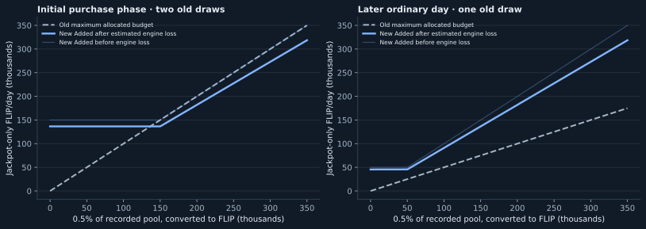

**At the bootstrap X of 25k:** the old two-draw budget was 25k; current early Added is 150k and returns approximately **136.5k** after the dice. The increase is roughly **111.5k/day** for this component. The old budget is an upper allocation, not a claim that every old draw actually paid it.

**Above the later floor:** current Added's expected return is approximately **1.82 times the old single-draw budget**: 0.91X versus 0.5X. At X = 150k, that is approximately **136.5k versus 75k**. At the later floor with X = 25k, it is approximately **45.5k versus 12.5k**.

The old system skipped empty near-future trait buckets and empty far-future levels, and discarded payout dust. Some of its budget could become whole craps passes, already counted within the budget. Consequently actual old issuance could be materially below the plotted line. The current filled-field model uses the whole main pool; free seats are a distribution of Added, not an extra payment on top of it.

**The ordinary 50k base is not newly introduced by this replacement.** It existed at the historical reference. The old ordinary schedule and prices also differed, so this chart is a controlled jackpot-component comparison, not a full replay of the previous craps economy. Purchase/transition timing and different recorded-pool snapshots can change a calendar-day comparison.

Historical sources: `DegenerusGameJackpotModule._calcDailyCoinBudget`, `_runFlipJackpot`, `_awardDailyCoinToTraitWinners`, `_awardFarFutureCoinJackpot`, `payDailyJackpotCoinAndTickets`; `DegenerusGameAdvanceModule` purchase branch, lines 744–756, at commit `6c885d590`.

## 9. Where the added value goes

### Ordinary subsidies and the progressive

The ordinary **50,000/day base** goes 50/50 to the main bonus ladder and the progressive: **25,000 each** before multiplier outcomes and rounding. Eligible action from the previous seven days adds a separate 12% allocation.

| Each 100 FLIP of eligible action | Main ladder | Progressive | Ordinary high-only ladder | Standard comps |
|---|---:|---:|---:|---:|
| Normal-lane action | 6 | 6 | 0 | 2 on the eligible comp basis |
| High-lane action | 2.4 | 2.4 | 7.2 | 2 on the eligible comp basis |

High-lane action's 12% splits 40% to the main allocation and 60% to its high lane. Half of the main allocation then enters the progressive. Standard comps generally use bankroll; a sole ordinary high bounty is eligible action but is not eligible standard-comp bankroll. A sole high's admitted ordinary high bonus also rides its run and can be lost.

### Jackpot Added and high rollers

Added goes entirely into the **main jackpot allocation**, alongside one 8,000 fee per paid base seat. Approximately half becomes base bankrolls and half the main bounty. There is no 50k ordinary ladder allocation inside the jackpot itself. The jackpot can release previously funded progressive prizes; that is not new jackpot Added.

Free awards are `min(floor(Added / 10,000), 500)`: normally **5 later or 15 early** at the floors. Changing who wins them changes distribution, not the gross Added budget. Seat count and boards can modestly change bankroll rounding and engine results.

**A high multiple does not multiply access to Added.** Each high seat has one base entry in the main field. Its other H−1 entries form a separate fee-only allocation, using the same fair jackpot multiplier. Extra high capital gets no Added, no jackpot high bonus and no multiplied purchase boon, and creates no future 12% action bonus.

High rollers can still win Added through their base entries. Many separate high base entries can collectively win a large share of the main field. The extra-high isolation therefore prevents H-fold subsidy weight; it does not exclude high players from the main prize. Ordinary high bonuses remain a separate subsidy channel described above.

### Jackpot extra-high loss recycling

For extra fees **E = (H−1) × 8,000**, the mean H is 21 and mean E is **160,000 per high day**.

| Extra-high treatment | Two or more high seats | One high seat |
|---|---:|---:|
| Expected capital exposed to dice | E/2 | E |
| Expected loss at 18% | 9% of E | 18% of E |
| New shared comp allowance | **4.8% of E** | **9.6% of E** |
| Expected loss retained after comps | 4.2% of E | 8.4% of E |
| Mean comp allocation per high day | **7,680** | **15,360** |

The rule gives comps **80% of a conservative 12% loss budget**, not 80% of actual losses. At actual loss of 16% / 18% / 20%, comps receive **60% / 53.3% / 48%** of expected extra-high loss. At the central estimate this is a narrow majority. That distinction matters if “most” is intended as an invariant rather than a calibration target.

## 10. What increases or decreases net emissions

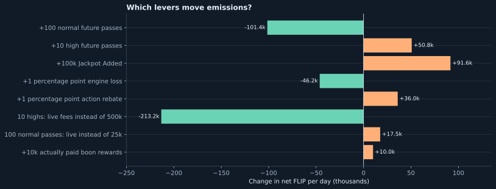

Changes are relative to the waterfall's **100 normal + 10 high future days**, Added 50k, 18% loss and one unfunded normal house. The action-rebate change is a policy counterfactual; the deployed rule remains 12%. Each row changes only the named input and includes its modeled downstream craps allocations.

| Driver | Effect on net emissions |
|---|---|
| More exposed bankroll lost to the engine | Decreases emissions. A higher return from boards, shooter mechanics or table selection does the reverse. |
| Higher recorded pool relative to ticket price | Raises Added after the floor stops binding. A higher ticket conversion price, holding the pool fixed, lowers this percentage component. |
| Moving from game level 1 to 2 | Reduces the minimum Added from 150k to 50k; roughly 91k less issuance while both floors would bind. |
| More normal future play | Usually offsets the fixed budget under the modeled loss scenarios. |
| More contested high future play | At 18% loss, contracts before comps and emits after comps. This is acceptable when the buyer loses and the comp fund receives the value; it is not automatically a player-profit opportunity. |
| Higher action rebate or comp rate | Returns more of engine losses as new rewards; decreases contraction. |
| Actual boons, quests or fresh free grants | Additional positive issuance, counted once at their funding origin. |
| Funded house entries, donations, reused passes/comps | Existing value pays for play. Do not label the full seat or pot as another fresh grant. |

## 11. Reward budgets move the break-even point

### Boons and quests

Purchase boons add 5%, 10% or 15% of eligible bankroll payouts, on a return basis capped at 60,000 per window. The absolute per-seat-day bonus ceiling is **54,000** across six windows; ordinary outcomes are much smaller. Busts add nothing; jackpot high extras are excluded.

At 18% loss, a 15% boon applied to every ordinary normal-bank return would have an **uncapped upper estimate of 1,336 per normal day**, before any jackpot boon. This is larger than the roughly 1,014 no-boon marginal contraction. The actual average is lower because of the payout cap and incomplete boon coverage. It must be measured or simulated; applying a flat bonus percentage to total fees is incorrect.

Qualifying craps-linked quest rewards can add 100 for a join quest and 800 for an offered level day-pass quest, with paired-quest effects. These are conditional rewards, not 900 for every buyer every day. Use their actual incremental frequency. The HTML calculator accepts total other new rewards/day to expose this sensitivity without inventing a frequency.

| Average extra reward per normal future day | Normal days to cover all issuance: Added 50k | Added 150k |
|---|---:|---:|
| 0, base model | 119 | 210 |
| 250 | 158 | 278 |
| 500 | 234 | 413 |
| 750 | 455 | 804 |
| 1,000 | 8,666 | 15,329 |

This is a sensitivity to **actual average incremental reward cost**, not a forecast of boon frequency. At about 1,014 of extra rewards per normal day, the central model's normal contraction margin is almost exhausted. Near that point, small changes in boards or rewards move the threshold enormously. A sufficiently positive per-pass reward margin cannot be offset by simply attracting more of the same play.

### Comp funding is a separate policy dial

No comp rule is changed here. The following counterfactual scales **all modeled comp allocations together**, including standard and extra-high comps, while leaving prizes and prices alone.

| Comp allocation relative to current rules | Marginal contested high net | Normal-only threshold, Added 50k / 150k | High-only threshold, Added 50k / 150k |
|---|---:|---:|---:|
| 0%, before-comp view | −7,204 | 95 / 167 | 17 / 30 |
| 50% | −1,063 | 105 / 186 | 113 / 200 |
| **100%, current rules** | **+5,078** | **119 / 210** | **No crossing** |
| 150% | +11,219 | 136 / 240 | No crossing |

The marginal high figure uses the later floor; the early-floor difference is less than one FLIP. Around **59% of today's total comp allocation** would make the high marginal system budget neutral under this calibration. That is an accounting reference, not a proposed target: keeping today's allocation is consistent with accepting modest issuance into the vault.

## 12. Participation feedback, growth and decline

The 12% action allocation uses the **average of the preceding seven days**, not today's action and not the sum of seven days. This makes the system path dependent during changes in participation.

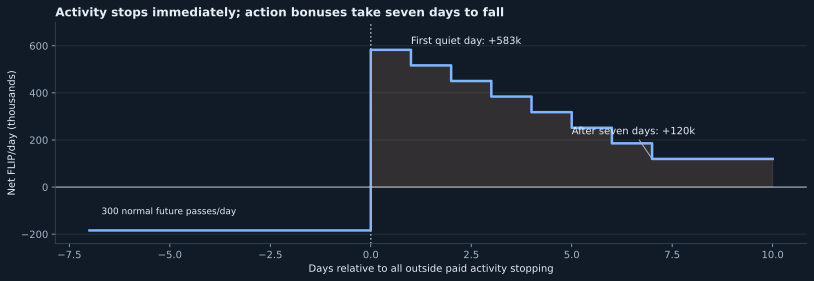

Example: 300 normal future passes/day have been played steadily at Added 50k, then outside paid play stops. The steady active day contracts by about **184k**. The first quiet day emits about **583k**, because it still carries the active week's bonus budget. After seven quiet days it returns to the **119.5k** modeled inactive baseline. The unfunded house remains active in this example.

During growth, current burns arrive before the trailing bonuses fully catch up, so the system initially contracts more than its steady-state curve suggests. During decline, the reverse occurs. Buying a pass today for later play also separates funding time from play time. Track reservations as liabilities to keep that timing from looking like free revenue.

### Participation and incentives

The intended loop is: **quiet field → more shared value per eligible entrant → more demand → thinner subsidy per entrant and more expected engine loss**. That is a sound direction of feedback. It can balance issuance without requiring quiet days to break even.

The demand equilibrium is where an additional player's obtainable prizes no longer justify entering, including preferences for gambling. The accounting break-even is where total new claims equal paid funding. **Those are different points**, particularly when the vault receives comps and prizes go to free seats or existing eligible players. The 119 / 210 counts are accounting thresholds, not predictions that participation will automatically settle there.

| Participant | Incentive and emissions consequence |
|---|---|
| Normal player | Fixed prizes offer more opportunity in a small field. Additional paid play ordinarily helps cover that fixed cost, but boards and boons change the margin. |
| High player | Buys more exposure and access to high contests. The 500k advance price is below entry EV by 21,325, but engine losses can exceed that discount. Shared comps are separate from the buyer's return. |
| EV-focused or coordinated players | Can choose boards, entry timing and whether to contest a high lane. The step from one high to two changes bounty risk; neither a fixed loss floor nor guaranteed extraction is established here. |
| Ticket holder receiving a free entry | Receives an allocation already financed by Added. More eligible holders primarily change who gets it and how concentrated wins are. |
| House and comp administrator | Reuse earned backing or saved entitlements. The house can also enter unfunded; vault participation does not receive that unconditional fallback. |

**There is no universal turnover threshold.** At a stable loss rate and buyer mix, the expected ledger has a calculable slope. Normal-heavy growth can cross into contraction; a high-heavy mix can keep emitting through the shared comp fund even while buyers lose. That exception is consistent with the intended reward policy. Boons, prize shares and board return determine whether a fresh entrant has repeatable positive EV. Player demand and optimal boards have not been solved as a game-theoretic equilibrium.

Custom battles follow a different local identity: **engine losses minus 2% eligible-bankroll comps, minus boons and attributable quests** is retained contraction. Funded bounties and donations cancel as transfers. Custom tables receive neither the scheduled 50k base nor Added nor the scheduled action rebate/progressive access. Their engine parameters can differ, so the scheduled 18% estimate should not be assigned to custom volume without a separate calibration.

## 13. Quiet-day emission and the size of exceptional days

### Expected emission is not a maximum payout

With no outside paid play, no prior outside action remaining in the book, and one unfunded normal house seat, the central estimates are **119.5k/day later** and **210.7k/day early**. Thirty such opened days correspond to about **3.59m / 6.32m** of net new commitments. These are operating scenarios, not a promise that game days continue indefinitely without activity.

Because this budget does not require fresh ETH that day, duration matters: the cost is the number of days the subsidy runs before attracted FLIP play absorbs it. The 150k early floor also lasts by game level, not a fixed number of calendar days. Quiet-day attraction is the intended way to shorten that period; its strength depends on who can actually claim the prizes.

The fixed expected allocations alone are **100k later / 200k early**: Added plus the existing 50k ordinary base. Added's bankroll loses some value; an unfunded house, its eligible action and its comps add some back. If the house pays using backing, its entry is not a fresh 24,825 grant. If it consumes a previously granted pass, count that grant at its original issuance rather than again on entry.

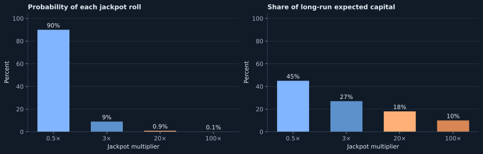

| Jackpot roll | Probability | Added 50k becomes | Added 150k becomes |
|---|---:|---:|---:|
| 0.5× | 90% | 25k | 75k |
| 3× | 9% | 150k | 450k |
| 20× | 0.9% | 1m | 3m |
| 100× | 0.1% | **5m** | **15m** |

These are **rolled Added capital**, before engine outcomes, and exclude paid fees and ordinary rewards. The mean multiplier is exactly one: most jackpots roll below their unmultiplied budget, while rare large rolls supply much of the average. Ordinary ladder multipliers also have mean one and can reach 100×; their progressive allocation is not multiplied by that ladder roll.

There is no single useful “maximum FLIP emitted on a zero-customer day” determined just by the 50k/150k floors. Added may exceed its floor; the prior week's action may be large; accumulated progressive or pass liabilities may be released; and dice returns can exceed rolled bankroll. Finite engine limits do not turn the Added table into a payout ceiling. The model reports expectation and sensitivities, not a certified worst-case payout bound.

**Initial entitlements are separate:** 200 normal-pass equivalents of comp allowance = **4.96m**, plus 20 normal passes each for the two protocol bodies = **992k** at pass face. Total startup allowance/pass face is **5.952m**, before later rewards. These are capacity/claims, not immediate liquid FLIP, and they are not daily emissions. Their later use must not be counted as a second fresh grant.

Shared record-pool awards and rewards supplied by other products are transfers into the craps payout stream from separately funded budgets. The core charts exclude those funding origins. A protocol-wide ledger should assign each origin once and track releases separately; this report does not value any subsequent wager.

## 14. Confidence, monitoring and reproducibility

### What is exact, and what is estimated

Contract-derived inputs include prices, preset probabilities, the mean high multiple of 21, multiplier probabilities, Added floors, award counts, seven-day averaging, action/comp rates, and the current fee-only high treatment. The analytical model enumerates both high multiples and all four jackpot multipliers, including base-bankroll granules and caps.

The **18% engine-loss input is estimated**, not guaranteed. The existing 12-million-run calibration produced the following results:

| Board strategy | 1-seat field | 40-seat field | 200-seat field |
|---|---:|---:|---:|
| All ten chips random | 17.52% | 17.86% | 18.25% |
| 3 Place 4, 1 Place 5, 3 Place 10; remainder random | 18.16% | 18.52% | 18.87% |

Each cell has two million samples, grouped into 20 blocks. Block-based standard errors range roughly 0.35–0.80 percentage points. Rare returns are heavy-tailed. The C++ economic replica uses a fast random mixer, not production hashing, and this exercise is not an exhaustive optimal-board search or a fresh EVM equivalence proof. The same loss input is applied across funding allocations; endogenous table selection and correlations between winning prizes and later play require a stateful model.

Ordinary bonus payout rounding is omitted. Boons, quests, external grants and shared-record funding are separated from the core charts. Progressive and comp liabilities are conservatively valued at face when granted, even if unspent. Actual future redemption can retire some of that value. All figures are conditional estimates of the specified budget boundary.

### Decisions and monitoring

| Priority / uncertainty | Why it matters | Useful measurement or policy choice |
|---|---|---|
| High: true engine loss and boon usage | Determines the operating margin; normal contraction can be consumed by reward costs | Measure exposed bankroll and return by board, field, window and boon, retaining tail events |
| High: desired fixed emission | The floor and doubled later percentage are intentional subsidy choices | Set an acceptable budget for quiet and active days; do not require zero emission by default |
| High: fresh-wallet player EV | Total system emission includes value the entrant cannot claim | Model zero-score entrant returns separately from comp funding; include actual prizes, boons, entry timing and repeatability |
| Medium: comp objective | 80% of the conservative budget is only about 53% of modeled actual loss | Decide whether the target means conservative-budget share or measured-loss share |
| Medium: stock versus flow | Progressive releases and recycled grants can look like fresh emission | Reconcile opening liabilities + new grants − consumed/released liabilities = closing liabilities |
| Medium: old jackpot utilization | Old empty draws make the replacement increase larger than a nominal comparison | Replay old eligible buckets if actual historical issuance, rather than configured budget, is needed |

The 500k retail price and 21× mean exposure are retained. No comp rate or score rule was changed. Net comp-fund issuance is not, by itself, a reason to weaken high passes. A reasonable budget dashboard would show **new issuance commitments, engine retirement, paid funding, pending bonus obligations, comp/pass stock, and external reward funding** independently. This preserves a clear view of how much deliberate subsidy players receive.

### Sources and files

- [Current prices and Added policy](../contracts/libraries/CrapsPriceLib.sol): `DAY_EV`, `HIGH_EV`, retail prices and `jackpotAdded`.
- [Jackpot funding](../contracts/JackpotBattle.sol): `lockJackpotBattle`, `_prepare`, `_append`, `_bookFees`.
- [Ordinary table and reward accounting](../contracts/CrapsBattle.sol): `_seatBody`, `_drawBudgets`, `_foldHigh`, `_boonBonus`, `_payout`; [shared constants](../contracts/storage/CrapsBattleStorage.sol).
- [Comp allowance and spending](../contracts/FLIP.sol); [conditional quest rewards](../contracts/DegenerusQuests.sol); [pool-snapshot selection](../contracts/modules/DegenerusGameAdvanceModule.sol), `_finalizeRngRequest`.
- [Raw engine calibration](CRAPS-ENGINE-EV-2026-09-28.tsv) and [calibration runner](../scripts/craps-engine-ev-calibration.py).
- [Report generator](../scripts/craps-emissions-report.py), [analytical ledger](../scripts/craps-ev-analysis.py), [scenario CSV](craps-emissions/scenarios.csv), [break-even CSV](craps-emissions/break-even.csv), [model data and source SHA-256 fingerprints](craps-emissions/model-data.json).

Run `python3 scripts/craps-emissions-report.py` to regenerate the eleven charts, data and standalone dark-mode HTML (Python: matplotlib, numpy, markdown; Node.js for calculator verification). The maintained Markdown is this file. The calculator is embedded locally in HTML and includes no external scripts. The generator verifies funding identities, 126 whole-system and 16 jackpot-only break-even/crossing cases, the 100-day projection and pending bonus balance at four engine-loss assumptions, reward sensitivities, the live/future pricing difference, separate before-comp and total-system margins, and calculator parity on 864 scenarios. “No crossing” high-only cases use an analytical lower bound. This is report/model verification; it does not rerun contract tests.

Historical reference: `git show 6c885d590:contracts/modules/DegenerusGameJackpotModule.sol` and the corresponding advance module. Current analysis includes uncommitted high-pool and award-selection changes; model JSON records file hashes so the reference is more precise than HEAD alone.
