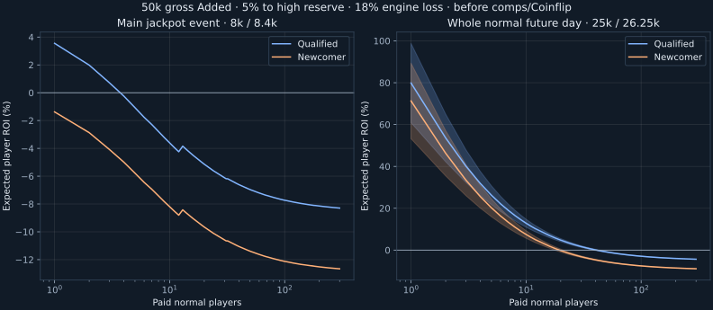

# Player EV with a 5% newcomer premium

A newcomer receives the same entry and rewards but pays 5% more. For an otherwise equivalent entry, qualified accounts retain exactly the surcharge as an expected-net-return advantage: **400 FLIP for the 8k main event; 1,250 for a 25k normal future day; 25,000 for a 500k high future day**.

```text
newcomer ROI = (1 + qualified ROI) / 1.05 - 1
```

A qualified-player ROI above +5% therefore still leaves positive newcomer EV. That is intentional under the accepted design.

## Assumptions

18% expected engine loss on exposed bankroll; one normal house seat; filled free-seat draws (5 at 50k Added, 15 at 150k); identical normal entry distributions and no score tie-breaks or payout cuts. Counts include the paid entrant being evaluated. Paid entrants do not also own the modeled free seats. Comps, quests, boons, donations, shared record awards and downstream Coinflip are excluded. Actual engine loss and board competitiveness can change the figures.

Five percent of gross Added now funds the high-roller reserve; normal entries compete for the other 95%. Free-seat counts still use gross Added. These normal-only scenarios receive no reserve prizes. The newcomer surcharge is a separate burn and creates no additional reward/action/comp basis.

## Main jackpot event: Added 50,000

Direct event return only; separate progressive awards and future action rewards are excluded.

| Paid normal entrants | Expected return | ROI at 8,000 | ROI at 8,400 |
|---:|---:|---:|---:|
| 1 | 8,284 | +3.6% | -1.4% |
| 5 | 7,914 | -1.1% | -5.8% |
| 10 | 7,711 | -3.6% | -8.2% |
| 25 | 7,544 | -5.7% | -10.2% |
| 50 | 7,443 | -7.0% | -11.4% |
| 100 | 7,381 | -7.7% | -12.1% |
| 200 | 7,348 | -8.1% | -12.5% |
| 500 | 7,327 | -8.4% | -12.8% |

## Entire normal future day: Added 50,000

Steady participation and a filled seven-day action book. Ranges allocate the daily progressive funding between the two eligible field sizes; they are not statistical confidence intervals. They value pass awards at face and include reward funding once. They do not price a particular live progressive balance or predict same-day liquid receipts. Ordinary bonus payout rounding is omitted.

| Paid normal day players | ROI at 25,000 | ROI at 26,250 |
|---:|---:|---:|
| 1 | +60.9% to +98.8% | +53.2% to +89.4% |
| 5 | +21.7% to +30.7% | +15.9% to +24.5% |
| 10 | +10.9% to +14.8% | +5.7% to +9.3% |
| 25 | +2.4% to +3.5% | -2.5% to -1.4% |
| 50 | -1.1% to -0.7% | -5.8% to -5.4% |
| 100 | -3.0% to -2.8% | -7.6% to -7.5% |
| 200 | -4.0% to -4.0% | -8.6% to -8.5% |
| 500 | -4.7% to -4.6% | -9.2% to -9.2% |

## Main jackpot event: Added 150,000

Direct event return only; separate progressive awards and future action rewards are excluded.

| Paid normal entrants | Expected return | ROI at 8,000 | ROI at 8,400 |
|---:|---:|---:|---:|
| 1 | 8,525 | +6.6% | +1.5% |
| 5 | 8,284 | +3.6% | -1.4% |
| 10 | 8,088 | +1.1% | -3.7% |
| 25 | 7,790 | -2.6% | -7.3% |
| 50 | 7,640 | -4.5% | -9.0% |
| 100 | 7,502 | -6.2% | -10.7% |
| 200 | 7,414 | -7.3% | -11.7% |
| 500 | 7,355 | -8.1% | -12.4% |

## Entire normal future day: Added 150,000

Steady participation and a filled seven-day action book. Ranges allocate the daily progressive funding between the two eligible field sizes; they are not statistical confidence intervals. They value pass awards at face and include reward funding once. They do not price a particular live progressive balance or predict same-day liquid receipts. Ordinary bonus payout rounding is omitted.

| Paid normal day players | ROI at 25,000 | ROI at 26,250 |
|---:|---:|---:|
| 1 | +52.9% to +99.8% | +45.6% to +90.3% |
| 5 | +18.0% to +32.2% | +12.4% to +25.9% |
| 10 | +9.2% to +16.2% | +4.0% to +10.7% |
| 25 | +2.0% to +4.6% | -2.8% to -0.4% |
| 50 | -1.0% to +0.1% | -5.7% to -4.7% |
| 100 | -2.9% to -2.4% | -7.5% to -7.0% |
| 200 | -3.9% to -3.7% | -8.5% to -8.3% |
| 500 | -4.6% to -4.5% | -9.2% to -9.1% |

## What moves the edge

Fewer competing seats and larger accumulated prizes improve player EV. More competing seats dilute fixed prizes. Greater bankroll loss reduces EV; earned boons and quests can improve it. High-roller participation also changes shared ordinary reward funding, so the normal-only table is not a universal mixed-field estimate. System emission thresholds differ because house/free-seat awards and vault comp funding also count toward system emissions.

The aggregate emissions report preserves the pre-reserve baseline; the high-roller reserve report gives the current allocation and its effect on system emissions. Each newcomer purchase adds a separate 5%-of-base burn; it does not multiply the prize budget.



Reproduce with `python3 scripts/craps-entry-pricing-analysis.py`.
