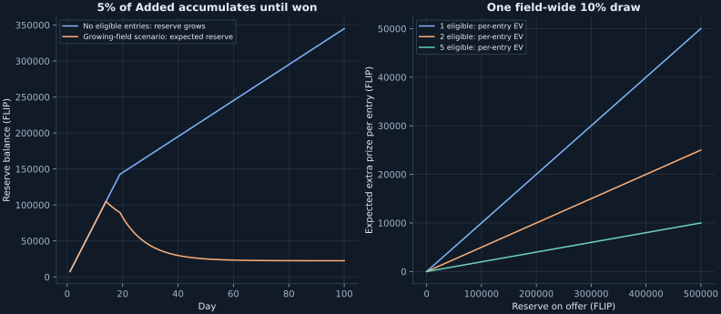

# A growing jackpot for high-roller participation

**Implemented and verified · 28 September 2026**

The goal is an accumulating prize that eventually makes trying high rollers attractive. A fixed small payout ceiling would limit that effect. A separate reserve, a fixed chance to win it, and dilution among eligible entrants provide the desired incentive: the longer nobody chases it, the more attractive it becomes; a win clears the accumulated opportunity.

## Implemented rules

1. Route **5% of unrolled jackpot Added** into a persistent high-roller reserve. The main field gets the other **95%**. This deliberately allows a small protocol subsidy for high participation, as newly requested. Do not also divert the high-loss remainder in this version.
2. With **zero eligible high entries**, make no draw and carry the entire reserve forward. An sDGNRS seat alone cannot trigger or win it; an eligible vault high seat can.
3. With **one or more eligible entries**, give the event a **10% chance to award the entire reserve**, including that event's contribution. A loss carries everything forward; a win pays one uniformly selected eligible entry and resets the reserve to zero.
4. Eligibility: a high entry accepted at its entry terms, with eligibility frozen before the settling RNG. The mint/pass check determines newcomer pricing; no activity-score gate applies to the reserve. **Exclude only sDGNRS from triggering and winning; the vault is eligible**, including when it is the sole eligible high entry. Qualifying pass entries can participate; entry still consumes their entitlement. This is an address rule, not proof that wallets represent different humans.
5. Keep one chance per eligible high entry. A 100× high multiple does not buy ten times the raffle weight of a 10× high multiple. Existing entry rules prevent an address taking duplicate paid places in the event; multiple addresses remain possible.

Use one field-wide draw, so adding another wallet does not increase the total draw probability. A separate uniformly random winner selection divides the opportunity among the eligible field. Both draws must use independent domain tags from the existing committed RNG and occur at most once per finalized event.

| Allocation | Early Added 150k | Later Added 50k |
|---|---:|---:|
| Main jackpot | 142,500 | 47,500 |
| New reserve contribution | 7,500 | 2,500 |

The main high-roller bankroll/bounty allocation remains fee-funded; this reserve is a separate bonus. Keep free-award counts based on **gross Added**, retaining the usual 15/5 awards. Comp percentages and the existing fee-action rules remain unchanged. Because the main pool is slightly smaller, its bankroll rounding and fee-action amounts can change modestly.

## Why it eventually becomes attractive

For reserve balance R and N eligible high entries, the expected bonus per entry is **0.10 × R / N**. It is a chance at a prize, not a guaranteed refund or a promise to recover the entry fee.

| Reserve on offer | One eligible entry | Two, per entry | Five, per entry |
|---|---:|---:|---:|
| 50,000 | 5,000 EV | 2,500 EV | 1,000 EV |
| 150,000 | 15,000 EV | 7,500 EV | 3,000 EV |
| 500,000 | 50,000 EV | 25,000 EV | 10,000 EV |

At the later floor, 30 empty events build **75k**; 60 build **150k**; 100 build **250k**. With the earlier scenario's 19 early events and 81 later events, 100 events without an eligible high would build **345k**. There is no small payout ceiling that prevents the advertised opportunity from growing.

As a concrete comparison, a **sole high on a known 10× day** pays 72k for its extra units beyond the normal base entry. At the model's 18% engine loss, their expected loss is **12,960**. A reserve of about **129,600** supplies that much expected bonus at a 10% draw chance, before considering other rewards. That is about **52 empty later-floor contributions**. This compares the incremental live-fee high upgrade with remaining normal; it does not value the 500k whole-day advance pass. A 100× day has a much higher extra fee and threshold.

Temporary positive EV when the pot becomes large is the intended attraction. A win removes the saved subsidy. Continued reward funding is restricted to 5% of Added, rather than an uncapped favorable payout for every purchase. The 5% newcomer entry premium gives qualifying players a better price for the same prize opportunity. Quiet-field positive EV for newcomers is permitted.

## One player, protocol seats, and multiple wallets

One eligible high gets a small **probability of winning the growing prize**—10%—rather than an automatic daily payment. With only sDGNRS in high seats, the reserve remains untouched. The vault counts like any other eligible high entry and can trigger and win the draw on its own. When the vault and other eligible players enter together, each gets equal raffle weight; sDGNRS gets none, regardless of its free passes or high multiple.

There is no abrupt reward unlock at two addresses. That matters because the existing move from one high seat to two changes extra bounties from riding a run to redistribution. Two coordinated seats can therefore have similar total extra capital at risk to one sole seat. Raising the entire subsidy sharply at “two players” would reward manufactured competition.

At a fixed reserve, one wallet has 10% of the prize in EV; two wallets controlled by the same person still have 10% collectively if they comprise the whole eligible field. Against other entrants, buying more qualifying entries can increase a player's share but also costs more. The mechanism does not establish a universal negative-EV guarantee; large saved prizes are deliberately meant to be chased.

## Effect on the requested 100-day scenario

Keep 10 players on day 1, add 3 per day, make every 50th player high, and switch to level 2 on day 20. Assume all those high entries qualify. This scenario does not add a separate vault high seat; if the vault plays high in addition to that field, its entry and eligibility must be included. The projection counts reserve credits as new reward value when funded and does not count subsequent reserve awards again.

| 100-day measure | Pre-reserve baseline | Implemented 5% reserve |
|---|---:|---:|
| Gross Added | 6.900m | 6.900m |
| Added allocated to the main field | 6.900m | 6.555m |
| Added allocated to the reserve | 0 | 345,000 |
| Cumulative net FLIP | **−1,239,165** | **−1,208,961** |
| Day-100 net FLIP | −110,910 | −110,807 |

This is mainly redistribution of an existing budget. The modeled net cost rises by about **30,204 over 100 days**, because the reserved share avoids main-bankroll engine losses, with a small offset from changed fee-action rewards. It is not a new 345k allocation on top of the existing Added budget.

If at least one eligible high participates every day from day 15 through day 100, expected reserve awards total **322,487**, with **22,513 remaining** at day 100. Those are expectations over random wins. The actual reserve is one carried balance and resets on each successful draw. Fewer eligible days delay awards and produce a larger remaining balance; the grant accounting is still counted once.

## Implementation and measurement

Entry and upgrade closure freeze eligibility before the settling word. Each settlement batch samples only the paid seats it just resolved, using one packed cursor/count/nominee record per event. Reservoir sampling gives each eligible high entry equal weight; the random hit/miss draw uses a separate domain tag. The last batch makes the event’s one decision. Replays cannot pay twice, and an empty event carries its contribution without a draw. Awards debit the reserve and credit the winner through Coinflip, without a pass split or additional action/comp funding. Downstream Coinflip outcomes remain outside this model.

Advertise the current prize, 10% field draw chance, eligible count, and per-entry chance. Track whether actual high upgrades increase as the reserve grows, how quickly a large prize attracts multiple entrants, and how often eligibility keeps a nominally nonempty field from drawing. The prescribed 100-day player path is a budget scenario, not a forecast of this behavioral response.

Read the live balance through `highRollerReserve()`. `highRollerDrawOf(slot)` exposes sampling progress; its eligible count is final after every paid seat has been examined. A nominee has won only when both `resolved` and `won` are true. `HighRollerReserveFunded` and `HighRollerReserveDrawn` provide the funding/release ledger. Frontends can count the frozen eligible field from entry/high-upgrade events before sampling finishes.

## Current whole-day budget

At the same 18% engine-loss assumption, one unfunded normal house seat, filled awards and steady normal future-day participation:

| Gross Added | Quiet-day net issuance, including reserve/comps | Normal days to break even before comps | Including comps |
|---|---:|---:|---:|
| 50,000 | +119,895 | 95 | 119 |
| 150,000 | +211,786 | 167 | 210 |

Reserve funding counts when allocated, even while nobody is eligible; the later payout is not counted a second time. These are expected-value estimates under the report assumptions, not guaranteed token flows.

Sources: [current jackpot allocation and fee accounting](../contracts/JackpotBattle.sol), [entry-pricing rule](CRAPS-ENTRY-PRICING-CONCEPT.md), [pre-reserve 100-day baseline](CRAPS-EMISSIONS-REPORT.md), and [reserve model](../scripts/craps-high-roller-incentive-proposal.py). Run the reserve model to regenerate [its data](craps-emissions/high-incentive-proposal.json); it checks Added allocation, reserve conservation, and net issuance on every day. The script also regenerates the current whole-day metrics and chart.

Verification: **573 tests passed across 42 suites**, including 1,000 randomized reserve chunk/retry checks, real-contract wiring, RNG-sealing invariants and worst-case purchase/day gas checks. The reserve suite covers empty-event accumulation, lock/preparation retries, all pool multipliers, sDGNRS exclusion, vault-only wins, newcomer pricing, passes/comps/upgrades, misses, carry-over and a 270-paid-seat field. Existing storage slots are unchanged; the two appended reserve slots match in both delegate contracts. CrapsBattle is 23,881 runtime bytes and JackpotBattle is 8,162, both below EIP-170. RNG and advance-call registries match source.
